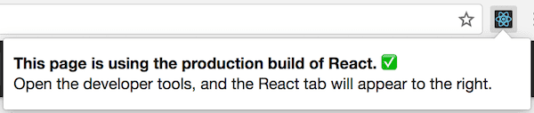
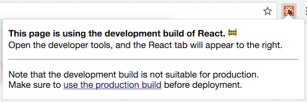

##### 5/06-08/2020
# Advanced Guides - Optimizing Performance
Internally, `React` uses several clever techniques to minimize the number of costly `DOM` operations required to update the UI.  For many applications, using `React` will lead to a fast user interface without doing much work to specifically optimize for performance.  Nevertheless, there are several ways you can speed up your `React` application.

---

## Use the Production Build:
If you're benchmarking or experiencing performance problems in your `React` app, make sure you're testing with the minified production build.

By default, `React` includes many helpful warnings.  These warnings are very useful in development.  However, they make `React` larger and slower so you should make sure to use the production version when you deploy the app.

If you aren't sure whether your build process is set up correctly, you can check it by installing `React` Developer Tools for Chrome.  If you visit a site with `React` in production mode, the icon will have a dark background:



If you visit a site with `React` in development mode, the icon will have a red background:



It is expected that you use the development mode when working on your app, and the production mode when deploying your app to the users.

You can find instructions for building your app for production below.

## `Create React App`:
If your project is built with `Create React App`, run:

```
npm run build
```

This will create a production build of your app in the `build/` folder of your project.

Remember that this is only necessary before deploying to production.  For normal development, use `npm start`.

## Single-File Builds:
We offer production-ready versions of `React` and `React` `DOM` as single files:

```html
<script src="https://unpkg.com/react@16/umd/react.production.min.js"></script>
<script src="https://unpkg.com/react-dom@16/umd/react-dom.production.min.js"></script>
```

Remember that only `React` files ending with `.production.min.js` are suitable for production.

## Brunch:
For teh most efficient Brunch production build, install the [`terser-brunch`](https://github.com/brunch/terser-brunch) plugin:

```
# If you sue npm
npm install --save-dev terser-brunch

# If you use Yarn
yarn add --dev terser-brunch
```

Then, to create a production build, add the `-p` flag to the `build` command:

```
brunch build -p
```

Remember that you only need to do this for production builds.  You shouldn't pass the `-p` flag or apply this plugin in development, because it will hide useful `React` warnings and make the builds much slower.

## Browserify:
For the most efficient Browserify production build, install a few plugins:

```
# If you use npm
npm install --save-dev envify terser uglifyify

## If you use Yarn
yarn add --dev envify terser uglifyify
```

To create a production build, make sure that you add these transforms (**the order matters**):
  * The `envify` transform ensures the right build environment is set.  Make it global (`-g`)
  * The `uglifyify` transform removes development imports.  Make it global (`-g`)
  * Finally, the resulting bundle is piped to `terser` for mangling

For example:

```
browserify ./index.js \
  -g [ envify --NODE_ENV production ] \
  -g uglifyify \
  | terser --compress --mangle > ./bundle.js
```

Remember that you only need to do this for production builds.  YOu shouldn't apply these plugins in development because they will hide useful `React` warnings, and make the builds much slower.

## Rollup
For the most efficient Rollup production build, install a few plugins:

```
# If you use npm 
npm install --save-dev rollup-plugin-commonjs rollup-plugin-replace rollup-plugin-terser

# If you use Yarn
yard add --dev rollup-plugin-commonjs rollup-plugin-replace rollup-plugin-terser
```

To create a production build, make sure that you add these plugins (**the order matters**):
  * The `replace` plugin ensures the right build environment is set
  * The `commonjs` plugin provides support for `CommonJS` in Rollup
  * The `terser` plugin compresses and mangles the final bundle

```js
plugins: [
  // ...
  require('rollup-plugin-replace')({
    'process.env.NODE_ENV': JSON.stringify('production')
  }),
  require('rollup-plugin-commonjs')(),
  require('rollup-plugin-terser')(),
  // ...
]
```

For a complete setup example [see this gist]().

Remember that only only need to do this for production builds.  You shouldn't apply the `terser` plugin or the `replace` plugin with `'production'` value in development because they will hide useful `React` warnings, and make the builds much slower.

## Webpack:
  > **NOTE**: If you're using `Create React App`, please follow the instructions above.  This section is only relevant if you configure webpack directly.

Webpack v4+ will minify your code by default in production mode.

```js
const TerserPlugin = require('terser-webpack-plugin');

module.exports = {
  mode: 'production',
  optimization: {
    minimizer: [new TerserPlugin({ /* additional options here */ })]
  }
};
```

YOu can learn more about this in [webpack documentation](https://webpack.js.org/guides/production/).

Remember that you only need to do this for production builds.  You shouldn't apply `TerserPlugin` in development because it will hide useful `React` warnings, and make the builds much slower.

---

## Profiling Components with the Chrome Performance Tab:
In the **development** mode, you can visualize how components mount, update, and unmount, using the performance tools in supported browsers.  For example:


To do this in Chrome:
  1. Temporarily **disable all Chrome extensions, especially `React` DevTools**. They can significantly skew the results!
  2. Make sure you're running the applications in the development mode
  3. Open the Chrome DevTools **Performance** tab and press **Record**
  4. Perform the actions you want to profile.  don't record more than 20 seconds or Chrome might hang
  5. Stope recording
  6. `React` events will be grouped under the **User Timing** label

  > **NOTE**: **the numbers are relative so components will render faster in production**.  Still, this should help you realize when unrelated UI gets updated by mistake, and how deep and how often your UI updates occur.

Currently Chrome, Edge, and IE are the only browsers supporting this features, but we use the standard [User Timing API](https://developer.mozilla.org/en-US/docs/Web/API/User_Timing_API) so we expect more browsers to add support for it.

---

## Profiling Components with the DevTools Profiler:
`react-dom` 16.5+ and `react-native` 0.57+ provide enhanced profiling capabilities in DEV mode with the `React` DevTools Profiler.  An overview of the Profiler can be found in the blog post "[Introducing the `React` Profiler](https://reactjs.org/blog/2018/09/10/introducing-the-react-profiler.html)".  A video walkthrough of the profiler is also [available on YouTube](https://www.youtube.com/watch?v=nySib7ipZdk).

If you haven't yet installed the `React` DevTools, you can find them here:
  * Chrome Browser Extension
  * Firefox Browser Extension
  * Standalone Node Package

  > **NOTE**: A production profiling bundle of `react-dom` is also available as `react-dom/profiling`.

---

## Virtualize Long Lists:
If your application renders long lists of data (hundreds or thousands of rows), we recommended using a technique known as 'windowing'.  This technique only renders a small subset of your rows as any given time, and can dramatically reduce the time it takes to re-render the components as well as the number of `DOM` nodes created.

`react-window` and `react-virtualized` are popular windowing libraries.  They provide several reusable components for displaying lists, grids, adn tabular data.  You can also create your own windowing component, like Twitter did, if you want something more tailored to your application's specific use case.

---

## Avoid Reconciliation:
`React` builds and maintains an internal representation of the rendered UI.  It includes the `React` elements you return from your components.  This representation lets `React` avoid creating `DOM` nodes and accessing existing ones beyond necessity, as that can be slower than operations on `JS` `objects`.  Sometimes it is referred to as a 'virtual `DOM`', but it works the same way on `React Native`.

When a component's props adn state change, `React` decides whether than actual `DOM` update is necessary by comparing the newly returned element with the previously rendered one.  When they are not equal, `React` will update the `DOM`.

Even though `React` only updates the changed `DOM` nodes, re-rendering still takes some time.  In many cases it's not a problem, but if the slowdown is noticeable, you can speed all of this up by overriding the lifecycle `function` `shouldComponentUpdate`, which is triggered before the re-rendering process starts.  The default implementation of this `function` returns `true`, leaving `React` to perform the update:

```js
shouldComponentUpdate(nextProps, nextState) {
  return true;
}
```

If you know that in some situations your component doesn't need to update, you can return `false` from `shouldComponentUpdate` instead, to skip the whole rendering process, including calling `render()` on this component and below.

In most cases, instead of writing `shouldComponentUpdate()` by hand, you can inherit from `React.PureComponent`.  It is equivalent to implementing `shouldComponentUpdate()` with a shallow comparison of current and previous props and state.

---

## `shouldComponentUpdate` In Action:
Here's a subtree of components.  For each one, `SCU` indicates what `shouldComponentUpdate` returned, and `vDOMEq` indicates whether the rendered `React` elements were equivalent.  Finally, the circle's color indicates whether the component had to be reconciled or not.


Since `shouldComponentUpdate` returned `false` for the subtree rooted at C2, `React` did not attempt to render C2, and thus didn't event have to invoke `shouldComponentUpdate` on C4 and C5.

For C1 and C3, `shouldComponentUpdate` returned `true`, so `React` had to go down to the leaves adn check them.  For C6 `shouldComponentUpdate` returned `true`, and since the rendered elements weren't equivalent `React` had to update the `DOM`.

The last interesting case of C8.  `React` had to render this component, but since the `React` elements it returned were equal to the previously rendered ones, it didn't have to update the `DOM`.

  > **NOTE**: `React` only had to do `DOM` mutations for C6, which was inevitable.  For C8, it bailed out by comparing the rendered `React` elements, and for C2's subtree and C7, it didn't event have to compare the elements as we bailed out on `shouldComponentUpdate`, and `render` was not called.

---

## Examples:
Fir the only way your component ever changes is when the `props.color` or the `state.count` variable changes, you could have `shouldComponentUpdate` check that:

```js
class CounterButton extends React.Component {
  constructor(props) {
    super(props);
    this.state = { count: 1 };
  }

  shouldComponentUpdate(nextProps, nextState) {
    if (this.props.color !== nextProps.color) return true;

    if (this.state.count !== nextState.count) return true;

    return false;
  }

  render() {
    return (
      <button 
        color={this.props.color}
        onClick={() => this.setState(state => ({count: state.count + 1}))}
      >
        Count: {this.state.count}
      </button>
    );
  }
}
```

In this code, `shouldComponentUpdate` is just checking if there is any change in `props.color` or `state.count`. If those values don't change, the component doesn't update.  If your component got more complex, you could use a similar pattern of doing a 'shallow comparison' between all the fields of `props` and `state` to determine if the component should update.  This pattern is common enough that `React` provides a helper to use this logic--just inherit from `React.PureComponent`. So this code is a simpler way to achieve the same thing:

```js
class Counter Button extends React.Component {
  constructor(props) {
    super(props);
    this.state = { count: 1 };
  }

  render() {
    return (
      <button
        color={this.props.color}
        onClick={() => this.setState(state => ({count: state.count + 1}))}
      >
        Count {this.state.count}
      </button>
    );
  }
}
```

Most of the time, you can use `React.PureComponent` instead of writing your own `shouldComponentUpdate`. It only does a shallow comparison, so you can't use it if the props or state may have been mutated in a way that a shallow comparison would miss.

This can be a problem with more complex data structures.  For example, let's say you want a `ListOfWords` component to render a comma-separated list of words, with a parent `WordAdder` component that lets you click a button to add a word to the list.  This code does _not_ work correctly.

```js
class ListOfWords extends React.PureComponent {
  render() {
    return <div>{this.props.words.join(',')}</div>;
  }
}

class WordAdder extends React.Component {
  constructor(props) {
    super(props);
    this.state = {
      words: ['marklar']
    };
    this.handleClick = this.handleClick.bind(this);
  }

  handleClick() {
    // This section is bad style and causes a bug
    const words = this.state.words;
    words.push('marklar');
    this.setState({words: words});
  }

  render() {
    return (
      <div>
        <button onClick={this.handleClick} />
        <ListOfWords words={this.state.words} />
      </div>
    );
  }
}
```

The problem is that `PureComponent` will od a simple comparison between the old and new values of `this.props.words`.  Since this code mutates the `words` `array` in the `handleClick` method of `WordAdder`, the old and new values of `this.props.words` will compare as equal, even though the actual words in the `array` have changed.  The `ListOfWords` will thus not update even though it has new words that should be rendered.

---

## The Power Of Not Mutating Data:
The simplest way to avoid this problem is to avoid mutating values that you are using as props or state.  For example, the `handleClick` method above could be rewritten using `concat` as:

```js
handleClick() {
  this.setState(state => {(
    words: state.words.concat(['marklar'])
  )});
}
```

`ES6` supports a spread syntax for `arrays` which can make this easier.  If you're using `Create React App`, this syntax is available by default.

```js
handleClick() {
  this.setState(state => ({
    words: [...state.words, 'marklar']
  }));
};
```

You can also rewrite code that mutates `objects` to avoid mutation, in a similar way.  For example, let's say we have an `object` named `colormap` and we want to write a `function` that changes `colormap.right` to be `'blue'`.  We could write:

```js
function updateColorMap(colormap) {
  colormap.right = 'blue';
}
```

To write this without mutating the original `object`, we can use `Object.assign` method:

```js
function updateColorMap(colormap) {
  return Object.assign({}, colormap, { right: 'blue' });
}
```

`updateColorMap` now returns a new `object`, rather than mutating the old one.  `Object.assign` is in `ES6` and requires a polyfill.

There is a `JS` proposal to add `object` spread properties to make it easier to update `objects` without mutation as well:

```js
function updateColorMap(colormap) {
  return { ...colormap, right: 'blue' };
}
```

If you're using `Create React App`, both `Object.assign` and the `object` spread syntax are available by default.

When you deal with deeply nested `objects`, updating them in an immutable way can feel convoluted.  If you run into this problem, check out [Immer](https://github.com/immerjs/immer) or [immutability-helper](https://github.com/kolodny/immutability-helper).  These libraries let you write highly readable code without losing the benefits of immutability.

---

[React Docs](https://reactjs.org/docs/optimizing-performance.html)